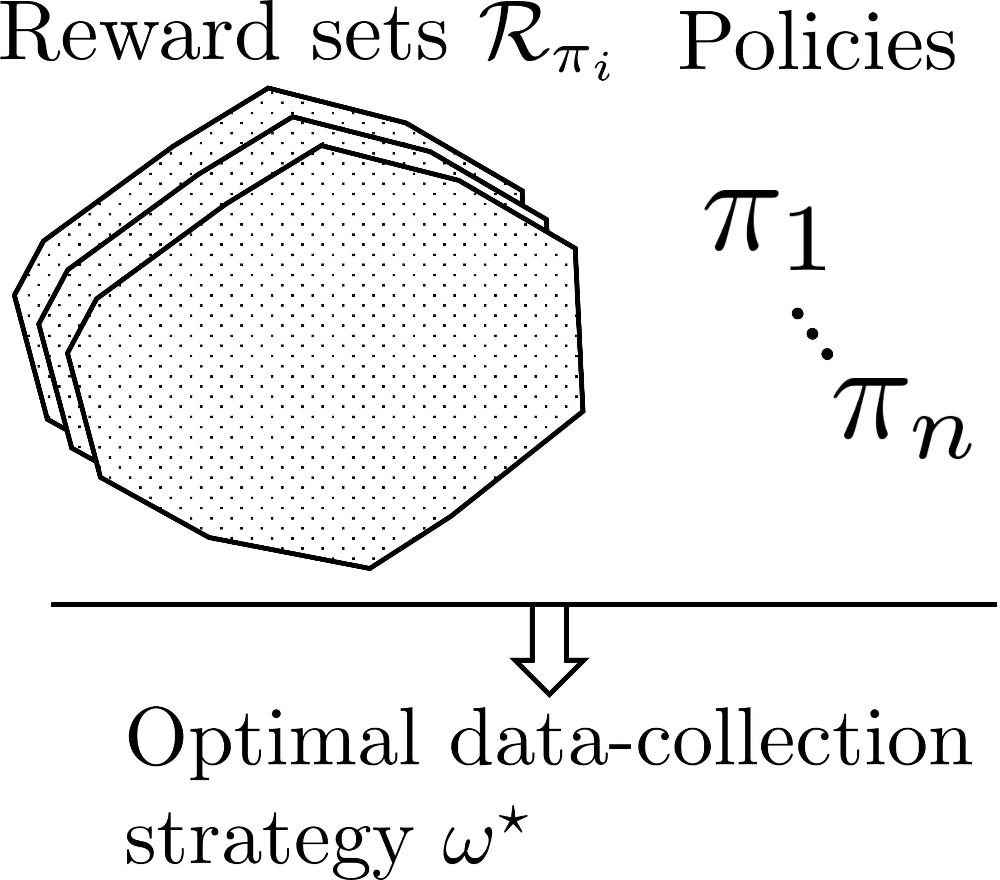

# Adaptive Exploration for Multi-Reward Multi-Policy Evaluation
Readme file for the "[Adaptive Exploration for Multi-Reward Multi-Policy Evaluation](https://arxiv.org/abs/2502.02516)", ICML 2025.

Author: Alessio Russo

License: MIT



## Folder structure

-  `config/`: contains the configurations for the agents/environments, etc.
-  `data/`: where the data is saved
-  `figures/`: figures are saved here
-  `multireward_ope/`: main library. Here are coded the agents and the environments


## Instructions

- Create a python environment using `python -m venv .venv`. We suggest using python3.10.
- Install the required libraries using `python -m pip install -r .\requirements.txt`. Make sure to have GUROBI installed.
- To reproduce the non-convexity example, execute the Jupyter notebook `example_non_convexity.ipynb`
- To reproduce the sample complexity example for riverswim, execute the Jupyter notebook `example_sample_complexity_riverswim.ipynb`
- To reproduce the main experiments, run the `run.sh` script. Inside, you can find the following variables
  

```bash

state_size=small            # State space size: small, medium or large
reward_set='Finite'         # Finite or RewardFree
single_policy=True          # True or False for MultiPolicy


```


These variables define the type of experiment (number of states, reward free vs finite rewards and single policy vs multi policy). Results are saved in the `data` folder.


Ensure that you also change the number of processes used in `config/tabular/config.yaml`, variable `experiment.num_processes` before running the experiments.
